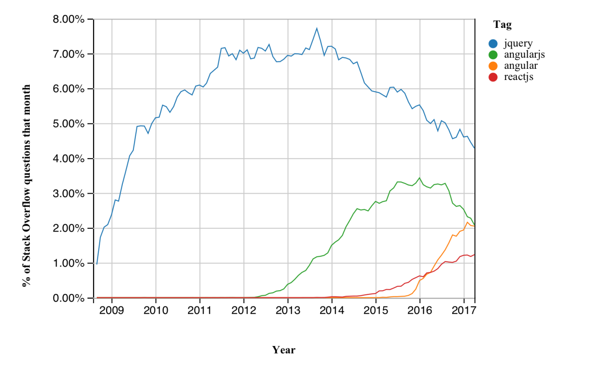

# The Rise and Fall of jQuery

In this blog I'm going to write about jQuery, probably the most popular framework, and why it's not what it once was. 

According to [Stack Overflow's trends tool](https://insights.stackoverflow.com/trends?tags=jquery%2Cangular%2Cangularjs%2Creactjs) jQuery (while still the biggest framework) is in decline:



I'm going to look at why it got so big, and why now you might want to learn something else.

## The Rise

In 2006 jQuery was awesome - it's hard to explain just how awesome now, but let's try.

Some usage stats from 2006:

- IE6 was king, with something like 60% market share.
- Older versions of IE were common, something like 25% of all visitors.
- Firefox had 9-10%.
- All the other browsers, including Safari, were the remaining <5%.
- Mobile was _much_ worse - many people still had [WAP](https://en.wikipedia.org/wiki/Wireless_Application_Protocol) phones, the majority of smart phones were Blackberry (remember them?) or Symbian.   
Most corporations' idea of a mobile offering was a separate site, with minimal or no JS and basic functionality.
- Chrome and iPhones weren't out yet.
- Servers were mostly Java or .NET WebForms (or PHP, or even CGI C/Perl scripts), the common pattern was to build all HTML content server side.

Each of the browsers exposed different DOM selection methods, had different ways of subscribing to events, and had different implementations of `XMLHttpRequest`.
Each browser was like a different app that needed its own testing.
jQuery fixed all that:

- **DOM Manipulation**   
`$('CSS selector')` instead of `document.all` vs `document` vs the many and horrible DOM corner cases (things like IE used to return `name` or `id` interchangeably and fail for a secret list of special names like `description`). [Sizzle](https://github.com/jquery/sizzle) made these performant too.    
You could easily create DOM elements with `$('<tag>content</tag>')` too.
- **Events**   
`element.on('click', function() {...})` instead of `attachEvent`/`detachEvent` vs `addEventListener`/`removeEventListener`.
This could also ensure the events listeners were removed, which was the commonest cause of memory leaks.
- **HTTP Requests**   
`$.ajax` instead of `XMLHttpRequest` vs `new ActiveXObject('MSXML2.XMLHTTP')` vs `new ActiveXObject('Microsoft.XMLHTTP')`.
- **Ready Event**   
`$(function(){...})` to fire anything you need after the page has loaded.
- **Chaining**    
As everything in jQuery returns the wrapper object functions can be chained `$('CSS selector').on('mouseover', function...).one('click', function...);`  
Many users found this a nice solution to the way JS handles variable scope.

jQuery (and all the similar frameworks) made all this _easy_ - just stick to jQuery functions and your code would work in all the browsers.
Web front end developers could learn jQuery and just get on with developing instead of faffing about with bloody IE awfulness.

There were still things to be careful of - IE still leaked if you [built DOM outside of the page](https://msdn.microsoft.com/en-us/library/bb250448%28v=vs.85%29.aspx?f=255&MSPPError=-2147217396).
To be safe you had to add an element, wait for page reflow, add its child, wait for page reflow, and so on.
Forget about your modern virtual DOM or custom elements - you either stall the UI while you build DOM, or use `.innerHTML`/`.html(content)`.

Components and plug-ins could depend on jQuery and be sure of it working in every browser.
This reduced the size of these components drastically, and created an ecosystem that could be depended on. 

There are still developers about who think jQuery and Javascript are the same thing, or as good as.

## The Fall

Right now, in 2017, there are very few new projects where jQuery is the right choice.

Over the last decade browsers have become a lot more standard (even IE), and mobile is far more important.
This is a problem when the main purpose of jQuery is standardisation and, more significantly, it's never really worked for mobile.

Over the last few years frameworks have shifted to put far more rendering on the client, or leverage [node.js](https://nodejs.org/) to build the same HTML on server or client. 
New technologies like [web components](https://www.webcomponents.org/introduction) (and many frameworks) now hook events directly into the DOM as it's rendered, which means there's no need to attach events onto static HTML created in another process/location.

Due to the improvements in standardisation it's now far more effective to shim missing features - far better to only have older browsers carry the overhead of downloading shims than have all browsers download wrapper frameworks.

Let's look at each key feature in more detail...

### DOM Manipulation

Most browsers now have [native support for getting elements by CSS3 selectors](https://developer.mozilla.org/en-US/docs/Web/API/Document/querySelectorAll):

```javascript
function $(selector, context) {
    // We have a selector, optionally apply the context
    var result = (context || document).querySelectorAll(selector);

    // If one element return it instead of the collection
    return result || result.length === 1 ? result[0] : result;
}
```

In every currently supported browser (except IE8, which only supports CSS2 selectors) that will find the element in the page, just like jQuery.

jQuery had a load more helper methods for building the DOM up - `$('selector')` would return a wrapper object with a load of helper methods attached.
This means that you always have the overhead of the wrapper, but also that a lot of jQuery code ends up a mash of DOM elements, `NodeList` and jQuery collections.

For instance, most jQuery coders will have seen something like this:

```javascript
$('selector').click(function() {
    // Turn DOM element we're acting on into a jQuery wrapper
    var $this = $(this);

    // Get the DOM element from the jQuery collection
    var domEle = $something[0];
})
```

This ugly pattern is so common in jQuery that there is an ersatz naming convention: we prefix variables that hold a jQuery object with `$`.

So, why didn't jQuery just extend all the DOM elements and avoid all this?
It turns out they didn't have much choice, in old versions of IE that would cause memory leaks. 

Meanwhile, the native methods for DOM manipulation are now pretty standard across all the browsers, making polyfilling the bad browsers a lot easier.

jQuery doesn't just select DOM elements - it also makes it easy to create DOM fragments like `$('<span>content</span>')`. 
We can add this to the replacement `$` method (somewhat simplified):

```javascript
function $(selector, context) {
    if(selector.indexOf('<') === 0) {
        // We'be been passed an HTML string, parse it as DOM content
        var outer = document.createElement('div');
        outer.innerHTML = selector; 
        return outer.children.length === 1 ? outer.children[0] : outer.children;
    }

    // See selector code above...
}
```

The problem is that setting `innerHTML` is actually fairly poor practice, especially if you want to make DOM changes that don't cause dropped frames and apparent [jank](http://jankfree.org/).
It would be far quicker to do this:

```javascript
var ele = document.createElement('span');
var text = document.createTextNode('content');
ele.appendChild(text);
return ele;
```

This isn't as nice code though, ideally we'd want to write something that looked a little more like the HTML we wanted to create.

#### Aside: Better DOM Creation

If adding raw HTML strings is slow, how about function names that match the tags they'll create:

```javascript
function createElement(tag, content) {
    var ele = document.createElement(tag);
    if(content) 
        ele.appendChild(document.createTextNode(content));
    
    return ele;
}

// Then helper methods for different tags
function div(content) { return createElement('div', content); }
function span(content) { return createElement('span', content); }
// ... etc

var newSpan = $('<span>content</span>');
// becomes
var newSpan = span('content');
```

This is better, but limited. Really we want to set attributes, add children and subscribe to events, which adds a [bit of complexity](https://gist.github.com/KeithHenry/ef0148e5f968f2d2de27b76ceffd08f3).

Well that's one option for HTML-like JS code, and it's a _lot_ faster than jQuery. Here is a [JS Fiddle Demo](https://jsfiddle.net/KeithHenry/7snzkugx/) if you want to try it yourself. Here is a [similar example](https://hackernoon.com/how-i-converted-my-react-app-to-vanillajs-and-whether-or-not-it-was-a-terrible-idea-4b14b1b2faff).

What about parsing the HTML and then manipulate the DOM directly to build it? Then we wouldn't need the almost-HTML JS functions, and it would be quick and easy to read, right?

Yes, and that's what [JSX](http://buildwithreact.com/tutorial/jsx) does.
In fact JSX factory classes look a lot like our `make` example above (but a lot more sophisticated, obviously).

Now we have a code representation of the DOM we can add more optimisations, such as rendering the elements with a worker or applying a difference comparision between the DOM we have and the DOM we want automatically.
This is what [React](https://facebook.github.io/react/) and [Preact](https://github.com/developit/preact) do.

There are lots of new frameworks that make it easy to create performant DOM elements and that are better (smaller, faster, more features) for DOM manipulation.

### Events

jQuery makes subscribing to events easy: `$('selector').on('event', handler);`

In all the good browsers (and even IE9) this is also easy without jQuery: `element.addEventListener('event', handler);`

Since jQuery launched with it's `on`/`off` event subscriptions new features have come to events. For instance, Chrome and FX support passive events (jQuery [doesn't yet](https://github.com/jquery/jquery/issues/2871)) which avoid dropping frames waiting to see whether an event will be cancelled:

```javascript
// In handler preventDefault() will be ignored
element.addEventListener('event', handler, { passive: true });
```

jQuery's `one` event subscriptions have also been replaced by native support in Chrome and FX:

```javascript
// Single use event that only fires once in Chrome/FX
element.addEventListener('event', handler, { once: true });

// Though it's not too hard to do this in IE
element.addEventListener('event', function handler(event) {
    // Remove the event listener
    event.currentTarget.removeEventListener(event.type, handler);
});
```

In IE8 you're stuck with `attachEvent`, but it is fairly easy to shim.

### HTTP Requests

All the browsers (except IE) now support [`fetch`](https://developer.mozilla.org/en/docs/Web/API/Fetch_API), which includes support for streams and response handling that `XMLHttpRequest` wrappers struggle with.
It's better to shim support for that in IE than it is to use `$.ajax`.

jQuery's `$.ajax` utility uses their [deferred object](https://api.jquery.com/category/deferred-object/), while `fetch` (and other APIs) are using `Promise`. 
Deferred is compatible with promises, so you can use [`async`/`await`](https://www.evolutionjobs.com/uk/media/async-programming-in-js-76719/), but it's slightly different from native `Promise` implementations so has some issues.

### Ready Event 

The way jQuery handles the DOM ready event has been, for most of its life, the most _awesome_ thing.
Easy hook up of events, firing when all the DOM was ready to go, it was great. 
Now it's jQuery's greatest weakness.

It's not hard to add this behavior to our noddy jQuery replacement:

```javascript
function $(selector, context) {
    // If passed a function
    if(typeof selector === 'function')
    {
        if(document.readyState === 'complete')
            // DOM content already loaded, fire once the current script block has finished
            window.setTimeout(selector);
        else
            // Listen for the content loaded event
            document.addEventListener('DOMContentLoaded', selector, { once: true });

        return;
    }

    // See above for earlier examples when typeof selector === 'string'
}
```

Again, this simplifies what jQuery does - it tries to fire early (as soon as `document.readyState !== 'loading' && !document.documentElement.doScroll`).

jQuery doesn't support `async` loaded scripts (it needs to load before anything that relies on it), but it can't even `defer` loading scripts (because it tries to [fire as soon as the page is interactive](https://github.com/jquery/jquery/issues/3271)). 
It's poor at managing the progressive content.

This is fine in many cases, where the user visits the site and happily waits for all the JS to load before clicking on anything, but it's a problem in the many cases where the user doesn't wait.
jQuery suffers from a potentially long gap (the ['uncanny valley'](https://aerotwist.com/blog/when-everything-is-important-nothing-is/)) between the HTML loading and it being interactive that's really ugly, especially on mobile.

### Mobile

Mobile devices suffer from slower connections, higher latency, and even modern powerful phones don't want to be spending lots of battery and heat (which is the main performance limiter for most of them) parsing loads of JS. 
The fastest phones on the market are _10 times_ slower than the average desktop, running flat out and burning through their battery. 
The average phone is _far_ slower, especially if you [want customers from most of the world](https://www.smashingmagazine.com/2017/03/world-wide-web-not-wealthy-western-web-part-1/).
200ms parsing and executing jQuery becomes 2 seconds of waiting with an uninteractive page.
20ms of overhead on a click event becomes 200ms of lag where the user will tap the button again.

A big part of optimising for mobile is [reducing the amount of script that the browser actually needs to parse](https://medium.com/reloading/javascript-start-up-performance-69200f43b201).
It really doesn't matter how fast your code is, your application still has to pay per KB to download and parse it before it can execute.
Compression will help with the former, but won't make the scripts any quicker to parse.

jQuery isn't compatible with Progressive Web Apps (PWA) or [Accelerated Mobile Pages (AMP)](https://www.ampproject.org/).
In fact it isn't compatible with many mobile best practices:

- Execute all scripts asynchronously (jQuery's ready event blocks this)
- Don't block rendering waiting for resources to load or JS to run.
- Only use GPU accelerated animations (no `.slideUp()`/`.slideDown()`, amoungst many others)
- Only load the script you'll need (e.g. jQuery will still include unreachable code for handling for IE8's `attachEvent` in mobile Chrome)

jQuery does have a [mobile touch-optimised version](https://jquerymobile.com/). 
It's 196KB (un-compressed) on top of jQuery (another 86KB).
That's all I have to say about that.

While jQuery has always claimed to be _lightweight_, in the mobile context it really _really_ isn't.

### Paradigm Shift

The biggest issue with jQuery is that it's so well optimised for a previous paradigm:

- In 2005 it was common practice for a Java or .NET server to build static HTML with inlined JS events.   
IE7 (and below) could download (at most) [2 files at a time](http://www.stevesouders.com/blog/2008/03/20/roundup-on-parallel-connections/) over HTTP per server (to be fair to IE this limit was in the [spec](http://www.ietf.org/rfc/rfc2616.txt), everyone else ignored it first).
This meant fewer, larger JS files with as little change between pages as possible.
Mobile was an afterthought.
- By 2010 most were still building static HTML, but events would be subscribed to in separate client side code.    
jQuery is well suited for this pattern.   
Mobile was all about native app development, in fact the received wisdom was that apps were the _only_ way - performance on mobile web was [just too hard](https://techcrunch.com/2012/09/11/mark-zuckerberg-our-biggest-mistake-with-mobile-was-betting-too-much-on-html5/).
- In 2017 we're seeing more and more REST services with either client side rendering or rehydration, maybe web components, all of which build the DOM and hook up events as they go.   
Best practice with most projects is now mobile-first; target the lowest common denominator and your app will be performant everywhere.

And that's a problem for the old paradigm: if you've creating DOM client side you should be optimising building of that DOM and adding events as you go. 
Many frameworks now build complex DOM virtually so that the page is always performant.
You really shouldn't be adding DOM with slow `.innerHTML`, then using a selection engine like Sizzle (with yet more code) to find the elements just rendered, and then hook up their events with another wrapper object.

#### HTTP/2

A new version of HTTP is coming: [HTTP/2](https://http2.github.io/). 
[Most of the browsers now support it](https://caniuse.com/#feat=http2).
HTTP/2 makes it much quicker for browsers to download multiple files at once.

Even without HTTP/2 older browsers (like IE8) can download more files at the same time.

This part of the paradigm isn't very stable yet, so it's too early for a very concrete description, but this is my prediction for where it will go next:

- App loads with tiny, heavily optimised, core library.
- That then loads in shims as needed - Chrome users will get none, while IE users will have to wait longer.
- Resources and shims will be small files loaded in parallel over HTTP/2
- [Preload](https://developers.google.com/web/updates/2016/03/link-rel-preload), [service workers](https://developers.google.com/web/fundamentals/getting-started/primers/service-workers) and [HTTP/2 push](https://http2.github.io/faq/#whats-the-benefit-of-server-push) will get most resources to users before they ask for them.

In this paradigm frameworks that load a big library up front and then use the same JS on every page are less well suited.

## So What Next for jQuery?

jQuery isn't going anywhere anytime soon.
There are loads of really impressive projects and components that rely on it.
There is a huge ecosystem of component available that rely on it, including stalwarts like [Twitter Bootstrap](http://getbootstrap.com/) (though the new [Twitter Lite does not](https://blog.twitter.com/2017/how-we-built-twitter-lite)).
Some of the best applications that I've ever used rely on it.
Even this website uses it.

Throughout the examples above I've been building up an [implementation of `$`](https://gist.github.com/KeithHenry/a8bf5e85cc1bec1281799fd7120e4ae8) (here is a [JS Fiddle playground](https://jsfiddle.net/KeithHenry/stw0twg3/) using it), but there are much more complete replacement implementations, such as [Zepto](https://github.com/madrobby/zepto) (just 26KB vs jQuery's 86KB).
Another example is [jqlite](https://github.com/kiltjs/jqlite) (20KB), which is [used by Angular for jQuery-like support](https://gist.github.com/esfand/9638882). 
However, support has been dropped in Angular 2 in favour of direct DOM manipulation methods (like those above). 

[Aurelia](http://aurelia.io/), [Ember](https://www.emberjs.com/), [Angular 4](https://angular.io/), [React](https://facebook.github.io/react/), [Preact](https://preactjs.com/), [Polymer](https://www.polymer-project.org/) - none of these need jQuery. 
They all include their own (mostly better) ways of manipulating DOM, hooking up events, making HTTP requests and initialisation.

## Recruitment & Skills

There are a lot of JS developers who reach for jQuery for _every_ project.
That can be both a good and a bad thing.

From a team management point of view: jQuery is ubiqutous, mature, and easy to learn. 
For all of the exciting new frameworks listed above one of the top [Stack Overflow](http://stackoverflow.com) questions is _"How do I use {framework} with jQuery"_.
jQuery developers are cheaper and easier to source than, say, React or Angular specialists.

If you need to build a large team and you're dealing with corporate or internal customers then jQuery is a pragmatic choice.

Conversly, if you're personally searching for a new web front-end or UI job then you need to be looking past jQuery. 
There are [lots](http://youmightnotneedjquery.com/) of [sites](https://blog.garstasio.com/you-dont-need-jquery/) that can teach you ways of working without it. 
jQuery should be just one of a set of JS skills that you have and (as with any framework) you should have a good understanding of how it works, the trade-offs it has made, and the circumstances where it's most suited.
You should be as comfortable coding vanilla JS with no libraries loaded at all as you are with jQuery.

## Conclusion

jQuery has a place in history.
By making it easier to develop consistent, rich functionality, web applications it made them much more mainstream.
In turn that's lead to a whole shift in browsers and server functionality.

jQuery is very much alive and kicking.
It's probably the single most commonly used framework - you won't struggle to find developers that know how to use it.

However, jQuery is a decade old paradigm and the goalposts have moved.
In a future of PWAs, mobile-first, and HTTP/2 it's hard to see a place for it. 